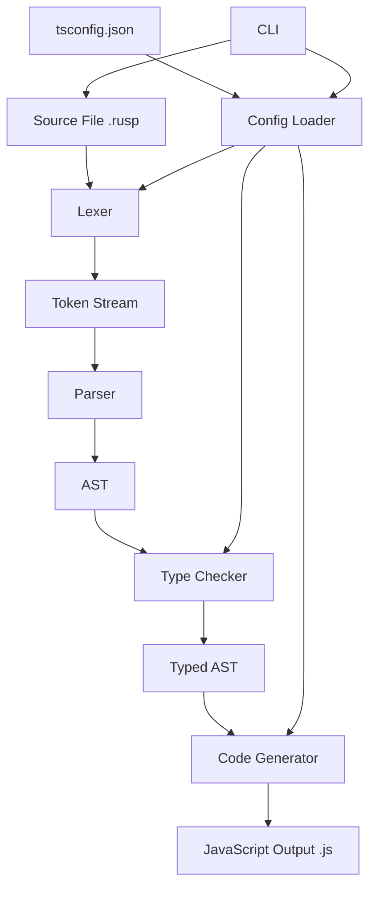

# RustScript Compiler Design Document

## Overview

RustScript is a TypeScript-based compiler that transpiles Rust-like syntax into optimized JavaScript. The compiler follows a traditional multi-phase architecture: lexical analysis, parsing, type checking, and code generation. Each phase is designed as an independent module with well-defined interfaces, enabling testability and maintainability.

The compiler processes `.rusp` source files through a pipeline that produces `.js` output files. It integrates with the TypeScript ecosystem via tsconfig.json configuration and provides a CLI for build process integration.

## Architecture



### Compiler Pipeline

1. **CLI Entry Point**: Parses command-line arguments and loads configuration
2. **Lexer**: Converts source text into tokens with location information
3. **Parser**: Builds an Abstract Syntax Tree from tokens
4. **Type Checker**: Validates types and annotates AST with type information
5. **Code Generator**: Transforms typed AST into JavaScript code

## Components and Interfaces

### 1. Token Types

```typescript
interface SourceLocation {
  line: number;
  column: number;
  offset: number;
}

interface SourceSpan {
  start: SourceLocation;
  end: SourceLocation;
  file: string;
}

type TokenKind =
  // Keywords
  | 'let' | 'mut' | 'fn' | 'struct' | 'enum' | 'impl'
  | 'if' | 'else' | 'while' | 'for' | 'match' | 'return'
  | 'pub' | 'const' | 'type' | 'trait' | 'use' | 'mod'
  // Literals
  | 'integer' | 'float' | 'string' | 'char' | 'bool'
  // Identifiers
  | 'identifier'
  // Operators
  | 'plus' | 'minus' | 'star' | 'slash' | 'percent'
  | 'eq' | 'neq' | 'lt' | 'gt' | 'lte' | 'gte'
  | 'and' | 'or' | 'not'
  | 'assign' | 'plusAssign' | 'minusAssign'
  // Delimiters
  | 'lparen' | 'rparen' | 'lbrace' | 'rbrace' | 'lbracket' | 'rbracket'
  | 'comma' | 'colon' | 'semicolon' | 'arrow' | 'fatArrow' | 'dot'
  // Special
  | 'eof';

interface Token {
  kind: TokenKind;
  value: string;
  span: SourceSpan;
}
```

### 2. Lexer Interface

```typescript
interface LexerResult {
  tokens: Token[];
  errors: CompilerError[];
}

interface Lexer {
  tokenize(source: string, filename: string): LexerResult;
}
```

### 3. AST Node Types

```typescript
type ASTNode =
  | Program
  | FunctionDecl
  | StructDecl
  | EnumDecl
  | LetStatement
  | Expression
  | Statement;

interface Program {
  kind: 'program';
  declarations: Declaration[];
  span: SourceSpan;
}

interface FunctionDecl {
  kind: 'functionDecl';
  name: string;
  params: Parameter[];
  returnType: TypeAnnotation | null;
  body: Block;
  isPublic: boolean;
  span: SourceSpan;
}

interface Parameter {
  name: string;
  type: TypeAnnotation;
  span: SourceSpan;
}

interface StructDecl {
  kind: 'structDecl';
  name: string;
  fields: StructField[];
  isPublic: boolean;
  span: SourceSpan;
}

interface StructField {
  name: string;
  type: TypeAnnotation;
  isPublic: boolean;
  span: SourceSpan;
}

interface EnumDecl {
  kind: 'enumDecl';
  name: string;
  variants: EnumVariant[];
  isPublic: boolean;
  span: SourceSpan;
}

interface EnumVariant {
  name: string;
  fields: TypeAnnotation[] | null;
  span: SourceSpan;
}

interface LetStatement {
  kind: 'letStatement';
  name: string;
  isMutable: boolean;
  type: TypeAnnotation | null;
  initializer: Expression;
  span: SourceSpan;
}

interface TypeAnnotation {
  kind: 'typeAnnotation';
  name: string;
  typeParams: TypeAnnotation[];
  span: SourceSpan;
}

type Expression =
  | LiteralExpr
  | IdentifierExpr
  | BinaryExpr
  | UnaryExpr
  | CallExpr
  | MemberExpr
  | IfExpr
  | MatchExpr
  | BlockExpr
  | StructExpr;

interface LiteralExpr {
  kind: 'literal';
  literalKind: 'integer' | 'float' | 'string' | 'char' | 'bool';
  value: string | number | boolean;
  span: SourceSpan;
}

interface BinaryExpr {
  kind: 'binary';
  operator: string;
  left: Expression;
  right: Expression;
  span: SourceSpan;
}

interface CallExpr {
  kind: 'call';
  callee: Expression;
  arguments: Expression[];
  span: SourceSpan;
}

interface MatchExpr {
  kind: 'match';
  scrutinee: Expression;
  arms: MatchArm[];
  span: SourceSpan;
}

interface MatchArm {
  pattern: Pattern;
  guard: Expression | null;
  body: Expression;
  span: SourceSpan;
}
```

### 4. Parser Interface

```typescript
interface ParseResult {
  ast: Program | null;
  errors: CompilerError[];
}

interface Parser {
  parse(tokens: Token[]): ParseResult;
}
```

### 5. Pretty Printer Interface

```typescript
interface PrettyPrinter {
  print(ast: Program): string;
}
```

### 6. Type System

```typescript
type Type =
  | PrimitiveType
  | StructType
  | EnumType
  | FunctionType
  | GenericType
  | UnitType
  | UnknownType;

interface PrimitiveType {
  kind: 'primitive';
  name: 'i32' | 'i64' | 'f32' | 'f64' | 'bool' | 'str' | 'char';
}

interface StructType {
  kind: 'struct';
  name: string;
  fields: Map<string, Type>;
}

interface EnumType {
  kind: 'enum';
  name: string;
  variants: Map<string, Type[] | null>;
}

interface FunctionType {
  kind: 'function';
  params: Type[];
  returnType: Type;
}

interface GenericType {
  kind: 'generic';
  name: string;
  typeArgs: Type[];
}

interface UnitType {
  kind: 'unit';
}

interface UnknownType {
  kind: 'unknown';
}
```

### 7. Type Checker Interface

```typescript
interface TypeCheckResult {
  typedAst: Program | null;
  errors: CompilerError[];
  typeMap: Map<ASTNode, Type>;
}

interface TypeChecker {
  check(ast: Program): TypeCheckResult;
}
```

### 8. Code Generator Interface

```typescript
interface GeneratorOptions {
  indent: string;
  sourceMap: boolean;
}

interface GenerateResult {
  code: string;
  sourceMap?: string;
}

interface CodeGenerator {
  generate(ast: Program, options: GeneratorOptions): GenerateResult;
}
```

### 9. Error Handling

```typescript
type ErrorSeverity = 'error' | 'warning' | 'info';

interface CompilerError {
  severity: ErrorSeverity;
  message: string;
  span: SourceSpan;
  code: string;
  suggestion?: string;
}

interface ErrorReporter {
  report(error: CompilerError): void;
  format(error: CompilerError, source: string): string;
  hasErrors(): boolean;
  getErrors(): CompilerError[];
}
```

### 10. CLI Interface

```typescript
interface CLIOptions {
  input: string[];
  output?: string;
  config?: string;
  strict?: boolean;
  help?: boolean;
  version?: boolean;
}

interface CLI {
  parse(args: string[]): CLIOptions;
  run(options: CLIOptions): Promise<number>;
}
```

### 11. Configuration

```typescript
interface RustScriptConfig {
  outDir?: string;
  strict?: boolean;
  target?: 'es5' | 'es6' | 'esnext';
  sourceMap?: boolean;
}

interface ConfigLoader {
  load(path?: string): RustScriptConfig;
}
```

## Data Models

### Token Stream
Tokens are produced sequentially by the lexer and consumed by the parser. Each token carries its source location for error reporting.

### Abstract Syntax Tree
The AST is a tree structure where:
- The root is a `Program` node containing declarations
- Declarations include functions, structs, enums, and impl blocks
- Statements include let bindings, expressions, and control flow
- Expressions are the leaves that compute values

### Type Environment
During type checking, a type environment maps identifiers to their types:
- Scopes are nested (function scope, block scope)
- Variables have types and mutability flags
- Functions have signatures with parameter and return types

### Symbol Table
Tracks all declared symbols:
- Functions with their signatures
- Structs with their field types
- Enums with their variants
- Variables with their types and mutability


## Correctness Properties

*A property is a characteristic or behavior that should hold true across all valid executions of a system-essentially, a formal statement about what the system should do. Properties serve as the bridge between human-readable specifications and machine-verifiable correctness guarantees.*

Based on the acceptance criteria analysis, the following correctness properties must be validated through property-based testing:

### Property 1: Parser Round-Trip Consistency

*For any* valid RustScript AST, printing the AST to source code and then parsing that source code back SHALL produce an equivalent AST.

This is the most critical property for the compiler. It ensures the parser and pretty printer are inverses of each other, validating both components simultaneously.

**Validates: Requirements 3.9, 3.10**

### Property 2: Lexer Token Location Accuracy

*For any* valid RustScript source code, every token produced by the lexer SHALL have accurate source location information such that extracting the substring at that location from the original source equals the token's value.

**Validates: Requirements 2.8**

### Property 3: Lexer Completeness

*For any* valid RustScript source code containing keywords, identifiers, literals, operators, and delimiters, the lexer SHALL produce a token stream where each construct is correctly categorized by token kind.

**Validates: Requirements 2.1, 2.2, 2.3, 2.4, 2.5, 2.6**

### Property 4: Comment and Whitespace Transparency

*For any* valid RustScript source code, adding or removing whitespace and comments between tokens SHALL not change the resulting AST structure (only span information may differ).

**Validates: Requirements 2.7**

### Property 5: Type Inference Determinism

*For any* valid RustScript program with type-inferable expressions, the type checker SHALL infer the same type regardless of the order in which declarations appear (within valid scoping rules).

**Validates: Requirements 4.3**

### Property 6: Mutability Enforcement

*For any* RustScript program containing an assignment to a variable declared without `mut`, the type checker SHALL report a mutability error.

**Validates: Requirements 4.8**

### Property 7: Type Annotation Consistency

*For any* RustScript variable declaration with an explicit type annotation, if the initializer's inferred type matches the annotation, the type checker SHALL accept the declaration; if they differ, the type checker SHALL report a type mismatch error.

**Validates: Requirements 4.2**

### Property 8: Function Call Type Safety

*For any* RustScript function call, the type checker SHALL accept the call if and only if the number and types of arguments match the function's parameter types.

**Validates: Requirements 4.4**

### Property 9: Code Generator JavaScript Validity

*For any* valid, type-checked RustScript AST, the code generator SHALL produce syntactically valid JavaScript that can be parsed by a JavaScript parser without errors.

**Validates: Requirements 5.1**

### Property 10: Let Binding Mutability Mapping

*For any* RustScript let binding, the code generator SHALL emit `const` for immutable bindings and `let` for mutable bindings in the JavaScript output.

**Validates: Requirements 5.5**

### Property 11: File Extension Validation

*For any* file path, the compiler SHALL accept the file if and only if it has a `.rusp` extension.

**Validates: Requirements 1.1, 1.2**

### Property 12: Multi-Error Reporting

*For any* RustScript source code containing multiple independent errors, the compiler SHALL report all errors rather than stopping at the first error.

**Validates: Requirements 7.4**

### Property 13: Error Location Completeness

*For any* compiler error, the error report SHALL include the file name, line number, column number, and the relevant source code line.

**Validates: Requirements 7.1, 7.2, 7.3**

### Property 14: Configuration Option Application

*For any* tsconfig.json with a valid `rustscript.outDir` setting, the compiler SHALL write output files to the specified directory.

**Validates: Requirements 9.2, 9.3**

### Property 15: AST Serialization Round-Trip

*For any* valid RustScript AST, serializing the AST to JSON and deserializing it back SHALL produce an equivalent AST.

**Validates: Requirements 3.9**

## Error Handling

### Error Categories

1. **Lexical Errors**: Invalid characters, unterminated strings, malformed numbers
2. **Syntax Errors**: Unexpected tokens, missing delimiters, invalid constructs
3. **Type Errors**: Type mismatches, undefined types, invalid operations
4. **Semantic Errors**: Undefined variables, duplicate declarations, mutability violations
5. **Configuration Errors**: Invalid tsconfig.json, missing required options

### Error Recovery Strategy

- **Lexer**: Skip invalid characters and continue tokenizing
- **Parser**: Use synchronization points (semicolons, braces) to recover and continue parsing
- **Type Checker**: Continue checking after errors to find additional issues

### Error Message Format

```
error[E0001]: type mismatch
  --> src/main.rusp:10:5
   |
10 |     let x: i32 = "hello";
   |                  ^^^^^^^ expected `i32`, found `str`
   |
   = help: consider using `parse()` to convert the string to a number
```

## Testing Strategy

### Property-Based Testing Framework

The compiler will use **fast-check** as the property-based testing library for TypeScript. This library provides:
- Arbitrary generators for primitive types
- Combinators for building complex generators
- Shrinking for minimal failing examples
- Reproducible test runs with seeds

### Test Configuration

Each property-based test will be configured to run a minimum of 100 iterations to ensure adequate coverage of the input space.

### Test Annotation Format

Each property-based test must be annotated with a comment referencing the correctness property:
```typescript
// **Feature: rustscript, Property 1: Parser Round-Trip Consistency**
```

### Unit Testing

Unit tests will complement property-based tests by covering:
- Specific edge cases (empty files, maximum nesting depth)
- Error conditions and error message formatting
- Integration between compiler phases
- CLI argument parsing

### Test Organization

```
tests/
├── unit/
│   ├── lexer.test.ts
│   ├── parser.test.ts
│   ├── typeChecker.test.ts
│   ├── codeGenerator.test.ts
│   └── cli.test.ts
├── property/
│   ├── lexer.property.ts
│   ├── parser.property.ts
│   ├── typeChecker.property.ts
│   └── codeGenerator.property.ts
└── generators/
    ├── token.generator.ts
    ├── ast.generator.ts
    └── source.generator.ts
```

### Generator Strategy

Custom generators will be created for:
- **Valid RustScript source code**: Generates syntactically correct programs
- **Valid AST nodes**: Generates well-formed AST structures
- **Type annotations**: Generates valid type expressions
- **Identifiers**: Generates valid identifier strings
- **Literals**: Generates valid numeric and string literals

Generators will be designed to produce a diverse range of inputs including:
- Simple cases (single declarations, basic expressions)
- Complex cases (nested structures, multiple type parameters)
- Edge cases (empty blocks, deeply nested expressions)
